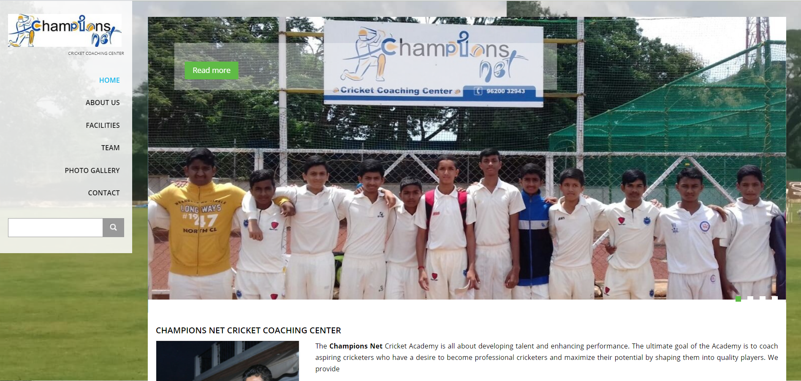

# Championsnet
1.Installed Drupal 8.8.5 
2.Customized Zymphonies custom theme 
3. Installed simple google map module and configured to create address navigation in contact form 
4. Installed Juice box HTML module and configured to create image gallery  
 
<a href = "https://championsnet.site/">Live Preview</a> 
